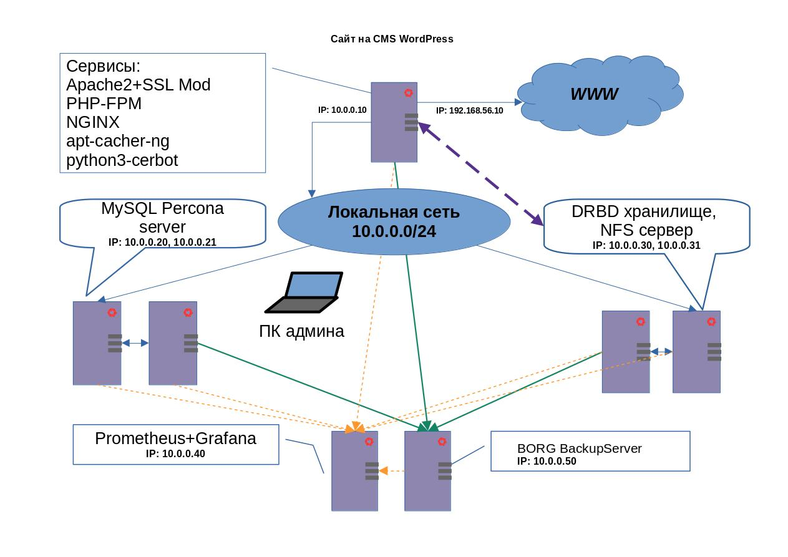

# Курс Administrator Linux. Professional

## Проектная работа

### Развертывание сайта на WordPress, Percona Server for MySQL, Borg Backup, Prometheus & Grafana с общим хранилищем DRBD   
  
**Создаём виртуальные машины**  
  
Использую _[Vagrantfile](Vagrantfile)_, который в репозитории  
  
```vagrant up```  
запускаем виртуальные машины  
  
Будут созданы виртуальные машины:  
с именем **_frontserver_**, ip-адресами - **_192.168.56.10 и 10.0.0.10_**  
с именем **_mysqlservernode1_**, ip-адресом - **_10.0.0.20_**  
с именем **_mysqlservernode2_**, ip-адресом - **_10.0.0.21_**  
с именем **_drbdnode1_**, ip-адресом - **_10.0.0.30_**  
с именем **_drbdnode2_**, ip-адресом - **_10.0.0.31_**  
с именем **_promethgraf_**, ip-адресом - **_10.0.0.40_**  
с именем **_backupserver_**, ip-адресом - **_10.0.0.50_**  


### Схема проекта

  

### Описание функционала серверов и их взаимодействие друг с другом

    На всех серверах _iptables_ с разрешенными портами для взаимодействия серверов между собой. Настроен пакетный менеждер для обновления и установки пакетов через прокси _apt-cacher-ng_. Установлен _node-expoter_ для *Prometheus.*  

1. **_frontserver_** имеет 2 сетевых интерфэйса с адресами _192.168.56.10 и 10.0.0.10_,   
10.0.0.10 внутреняя локалка, 192.168.56.10 смотрит в "интеренет". На сервере установлены сервисы для работы с WEB, а именно:
- Apache2 с включенным SSL-mod
- PHP-FPM
- Apt-cacher-ng - кэширующий прокси-сервер для загрузки deb,rpm и других пакетов из хранилищ.
- python3-cerbot бот для создания и продления сертификата от Let`s Encrypt
  Сервер взаимодействует по внутреней сети 10.0.0.0/24 с **_mysqlservernode1_** - раположена БД на MySQL, с **_drbdnode1_** сетевое хранилище для файлов сайта, смонтирована как /var/www/html (корневая папка сайта) и с **_backupserver_** для хранения файлов конфигурации выше описанных сервисов.
2. **_mysqlservernode1_** и **_mysqlservernode2_** Сервера Percona для MySQL. Сервер **_mysqlservernode1_** взаимодействует по внутреней сети 10.0.0.0/24 с **_frontserver_** - исполняет запросы к БД на MySQL, **_mysqlservernode2_** с **_backupserver_** для хранения дампа БД.
3. **_drbdnode1_** и **_drbdnode2_** DRBD — программная система, обеспечивающая синхронизацию (RAID 1) между локальным блочным устройством и удалённым. Взаимодействует по внутреней сети 10.0.0.0/24 с **_frontserver_** - хранение файлов сайта, с **_backupserver_** для хранения резервных копий папки сайта.
4. **_promethgraf_** Prometheus — это система мониторинга и оповещений, хранящая и обрабатывающая метрики и Grafana — свободная программная система визуализации данных, ориентированная на данные систем ИТ-мониторинга (в частности Prometheus). Взаимодействует со всеми серверами проекта по средствам node-exporter.
5. **_backupserver_** Cистема резервного копирования Borg Backup. Взаимодействует с **_frontserver_**, **_mysqlservernode2_**, **_drbdnode1_** .

### Очередность развертывания функционала серверов
   