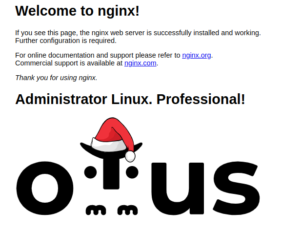

 
# Курс Administrator Linux. Professional

### Домашнее задание №18
### Работа с Docker

в ДЗ использую машину с установленым Docker

Основные команды в Docker:  

```bash
docker images - список образов 
docker ps - список запущенных контейнеров
docker ps -a  - список всех контейнеров
docker run -d -p port:port container_name  - запуск контейнера
docker stop container_name - запуск контейнера
docker logs container_name - вывод логов контейнеров
docker inspect container_name - информация по запущенному контейнеру
docker build -t dockerhub_login/reponame:ver - сборка образа 
docker push/pull  - закинуть/забрать образ на/из репозитория
docker exec -it container_name sh  - зайти в оболочку контейнера
```

**1. Написанине Dockerfile**  
  
Dockerfile это стандартное название, если файл будет иметь другое имя, то при сборке используем ключ -f  
Содержимое Dockerfile:  

```bash
FROM nginx:alpine-slim
ENV TZ=Europe/Moscow
COPY index.html /usr/share/nginx/html/
COPY logo.svg /usr/share/nginx/html/
EXPOSE 80
```
Собирается образ на основе официального NGINX  
ставим свой часовой пояс  
копирую кастомные файлы на замену дефолтных, в частности корректирую начальную страницу  
открываем порт в контейнере  

Собираем образ:  
```bash
docker build -t shark826/nginx-otus:1
```

Загружаем образ на репозиторий:  

```bash
docker push shark826/nginx-otus:1
```
Для использования кастомного образа нужно выполнить команду:  
```bash
docker run -d -p 80:80 --name ngotus shark826/nginx-otus:1
```
октройте http://localhost и увидим измененую страницу  NGINX  

  
  
  
либо по команде  
```bash
curl localhost
```
в конце увидим добавленные строки

```bash
<p></p>
<h1>Administrator Linux. Professional!</h1>
<p></p>

```

