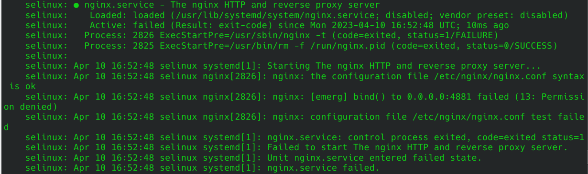
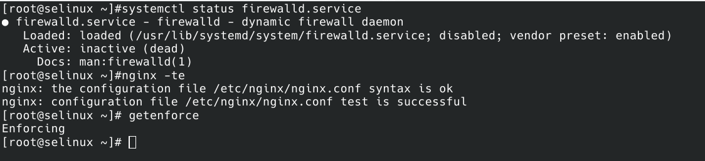

# Курс Administrator Linux. Professional

### Домашнее задание №13
### Практика с SELinux   


**Введение**  

SElinux (Security Enhanced Linux) – система принудительного (мандатного) контроля доступа (MAC). Разрабатывалась АНБ. В 2003
году вошла в состав ядра linux 2.6.x.  
SELinux следует модели минимально необходимых привилегий для каждого сервиса пользователя и программы.  

Зачем нужен Selinux:  
● Гибкое ограничение прав пользователей и процессов на уровне ядра  
● Работа совместно с DAC (матричным управлением доступа)  
● Снижение риска, возникающего вследствие допущенных ошибок  
● Ограничение потенциально опасных или скомпрометированных процессов в правах  
● Протоколирование  

Обычно в В Selinux большие и сложные политики. Каждый ресурс
должен быть описан и сопоставлен с сервисом.  

Режимы работы SELinux:  
**Enforcing** (по-умолчанию) – Активная работа. Всё, что нарушает
политику безопасности блокируется. Попытка нарушения фиксируется
в журнале.  
**Permissive** — запрещенные действия не блокируются. Все нарушения
пишутся в журнал  
**Disabled** — полное отключение SELinux.  

Важно помнить: классическая система прав Unix применяется первой и управление перейдёт к SELinux только в том случае, если эта первичная проверка будет успешно пройдена.  

Написать политику SELinux достаточно сложно, но для ключевых приложений и сервисов (например httpd, mysqld, dhcpd и т. д.)
определены заранее сконфигурированные политики, которые не позволят получить злоумышленнику доступ к важным данным.
Те приложения, для которых политика не определена, выполняются в домене *unconfined_f* и не защищаются SELinux.


**1. Запуск стенда с Vagrantfile**  

Запускаем виртуальную машину с готовым [Vagrantfile](Vagrantfile), Порт TCP 4881 уже проброшен до хоста. SELinux включен.  

Во время развёртывания стенда попытка запустить nginx завершится с
ошибкой:

```bash

    selinux: ● nginx.service - The nginx HTTP and reverse proxy server
    selinux:    Loaded: loaded (/usr/lib/systemd/system/nginx.service; disabled; vendor preset: disabled)
    selinux:    Active: failed (Result: exit-code) since Mon 2023-04-10 16:52:48 UTC; 10ms ago
    selinux:   Process: 2826 ExecStartPre=/usr/sbin/nginx -t (code=exited, status=1/FAILURE)
    selinux:   Process: 2825 ExecStartPre=/usr/bin/rm -f /run/nginx.pid (code=exited, status=0/SUCCESS)
    selinux: 
    selinux: Apr 10 16:52:48 selinux systemd[1]: Starting The nginx HTTP and reverse proxy server...
    selinux: Apr 10 16:52:48 selinux nginx[2826]: nginx: the configuration file /etc/nginx/nginx.conf syntax is ok                                                                                                      
    selinux: Apr 10 16:52:48 selinux nginx[2826]: nginx: [emerg] bind() to 0.0.0.0:4881 failed (13: Permission denied)                                                                                                  
    selinux: Apr 10 16:52:48 selinux nginx[2826]: nginx: configuration file /etc/nginx/nginx.conf test failed                                                                                                           
    selinux: Apr 10 16:52:48 selinux systemd[1]: nginx.service: control process exited, code=exited status=1
    selinux: Apr 10 16:52:48 selinux systemd[1]: Failed to start The nginx HTTP and reverse proxy server.
    selinux: Apr 10 16:52:48 selinux systemd[1]: Unit nginx.service entered failed state.
    selinux: Apr 10 16:52:48 selinux systemd[1]: nginx.service failed.
    
```
  
  
  

Данная ошибка появляется из-за того, что SELinux блокирует работу nginx на нестандартном порту.  

Заходим на сервер: *vagrant ssh*  
Дальнейшие действия выполняются от пользователя root. Переходим в root пользователя: *sudo -i*  


**2. Запуск nginx на нестандартном порту 3-мя разными способами**  

Проверим статус файервола:  

```bash
systemctl status firewalld.service 
● firewalld.service - firewalld - dynamic firewall daemon
   Loaded: loaded (/usr/lib/systemd/system/firewalld.service; disabled; vendor preset: enabled)
   Active: inactive (dead)
     Docs: man:firewalld(1)
```
Файервол загружен, но выключен  

Также можно проверить, что конфигурация nginx настроена без ошибок:  
```bash
nginx -t
nginx: the configuration file /etc/nginx/nginx.conf syntax is ok
nginx: configuration file /etc/nginx/nginx.conf test is successful
```  
Далее проверим режим работы SELinux: getenforce  
```bash
getenforce
Enforcing
```  

Должен отображаться режим *Enforcing*. Данный режим означает, что SELinux будет блокировать запрещенную активность.


  
