# Курс Administrator Linux. Professional

### Домашнее задание №13
### Практика с SELinux   


**Введение**  

SElinux (Security Enhanced Linux) – система принудительного (мандатного) контроля доступа (MAC). Разрабатывалась АНБ. В 2003
году вошла в состав ядра linux 2.6.x.  
SELinux следует модели минимально необходимых привилегий для каждого сервиса пользователя и программы.  

Зачем нужен Selinux:  
● Гибкое ограничение прав пользователей и процессов на уровне ядра  
● Работа совместно с DAC (матричным управлением доступа)  
● Снижение риска, возникающего вследствие допущенных ошибок  
● Ограничение потенциально опасных или скомпрометированных процессов в правах  
● Протоколирование  

Обычно в В Selinux большие и сложные политики. Каждый ресурс
должен быть описан и сопоставлен с сервисом.  

Режимы работы SELinux:  
**Enforcing** (по-умолчанию) – Активная работа. Всё, что нарушает
политику безопасности блокируется. Попытка нарушения фиксируется
в журнале.  
**Permissive** — запрещенные действия не блокируются. Все нарушения
пишутся в журнал  
**Disabled** — полное отключение SELinux.  

Важно помнить: классическая система прав Unix применяется первой и управление перейдёт к SELinux только в том случае, если эта первичная проверка будет успешно пройдена.  

Написать политику SELinux достаточно сложно, но для ключевых приложений и сервисов (например httpd, mysqld, dhcpd и т. д.)
определены заранее сконфигурированные политики, которые не позволят получить злоумышленнику доступ к важным данным.
Те приложения, для которых политика не определена, выполняются в домене *unconfined_f* и не защищаются SELinux.


**1. Запуск стенда с Vagrantfile**  

Запускаем виртуальную машину с готовым [Vagrantfile](Vagrantfile), Порт TCP 4881 уже проброшен до хоста. SELinux включен.  

Во время развёртывания стенда попытка запустить nginx завершится с
ошибкой:

```bash

    selinux: ● nginx.service - The nginx HTTP and reverse proxy server
    selinux:    Loaded: loaded (/usr/lib/systemd/system/nginx.service; disabled; vendor preset: disabled)
    selinux:    Active: failed (Result: exit-code) since Mon 2023-04-10 16:52:48 UTC; 10ms ago
    selinux:   Process: 2826 ExecStartPre=/usr/sbin/nginx -t (code=exited, status=1/FAILURE)
    selinux:   Process: 2825 ExecStartPre=/usr/bin/rm -f /run/nginx.pid (code=exited, status=0/SUCCESS)
    selinux: 
    selinux: Apr 10 16:52:48 selinux systemd[1]: Starting The nginx HTTP and reverse proxy server...
    selinux: Apr 10 16:52:48 selinux nginx[2826]: nginx: the configuration file /etc/nginx/nginx.conf syntax is ok                                                                                                      
    selinux: Apr 10 16:52:48 selinux nginx[2826]: nginx: [emerg] bind() to 0.0.0.0:4881 failed (13: Permission denied)                                                                                                  
    selinux: Apr 10 16:52:48 selinux nginx[2826]: nginx: configuration file /etc/nginx/nginx.conf test failed                                                                                                           
    selinux: Apr 10 16:52:48 selinux systemd[1]: nginx.service: control process exited, code=exited status=1
    selinux: Apr 10 16:52:48 selinux systemd[1]: Failed to start The nginx HTTP and reverse proxy server.
    selinux: Apr 10 16:52:48 selinux systemd[1]: Unit nginx.service entered failed state.
    selinux: Apr 10 16:52:48 selinux systemd[1]: nginx.service failed.
    
```
  
  
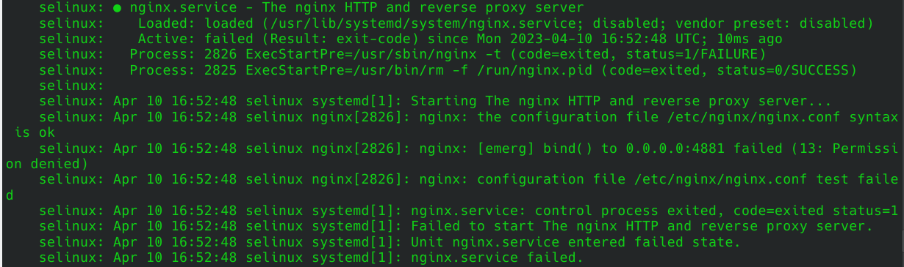  

Данная ошибка появляется из-за того, что SELinux блокирует работу nginx на нестандартном порту.  

Заходим на сервер: *vagrant ssh*  
Дальнейшие действия выполняются от пользователя root. Переходим в root пользователя: *sudo -i*  


**2. Запуск nginx на нестандартном порту 3-мя разными способами**  

Проверим статус файервола:  

```bash
systemctl status firewalld.service 
● firewalld.service - firewalld - dynamic firewall daemon
   Loaded: loaded (/usr/lib/systemd/system/firewalld.service; disabled; vendor preset: enabled)
   Active: inactive (dead)
     Docs: man:firewalld(1)
```
Файервол загружен, но выключен  

Также можно проверить, что конфигурация nginx настроена без ошибок:  
```bash
nginx -t
nginx: the configuration file /etc/nginx/nginx.conf syntax is ok
nginx: configuration file /etc/nginx/nginx.conf test is successful
```  
Далее проверим режим работы SELinux: getenforce  
```bash
getenforce
Enforcing
```  

Должен отображаться режим *Enforcing*. Данный режим означает, что SELinux будет блокировать запрещенную активность.


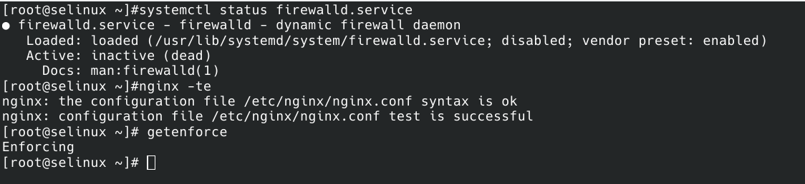  

**2.1 Разрешим в SELinux работу nginx на порту TCP 4881 c помощью переключателей setsebool**  

Находим в логах (/var/log/audit/audit.log) информацию о блокировании нашего нестандартного порта 4881  
```bash
cat /var/log/audit/audit.log | grep 4881
```
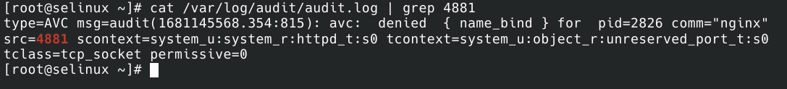  

Копируем метку времени, чтобы посмотреть информацию о запрете, с помощью утилиты audit2why (нужно установить дополнительно пакет policycoreutils-python)  

```bash
grep 1681145568.354:815 /var/log/audit/audit.log | audit2why
type=AVC msg=audit(1681145568.354:815): avc:  denied  { name_bind } for  pid=2826 comm="nginx" src=4881 scontext=system_u:system_r:httpd_t:s0 tcontext=system_u:object_r:unreserved_port_t:s0 tclass=tcp_socket permissive=0

        Was caused by:
        The boolean nis_enabled was set incorrectly. 
        Description:
        Allow nis to enabled

        Allow access by executing:
        # setsebool -P nis_enabled 1
```

Утилита audit2why покажет почему трафик блокируется. Исходя из вывода утилиты, мы видим, что нам нужно поменять параметр nis_enabled.  
Включим параметр nis_enabled и перезапустим nginx: *setsebool -P nis_enabled on*  

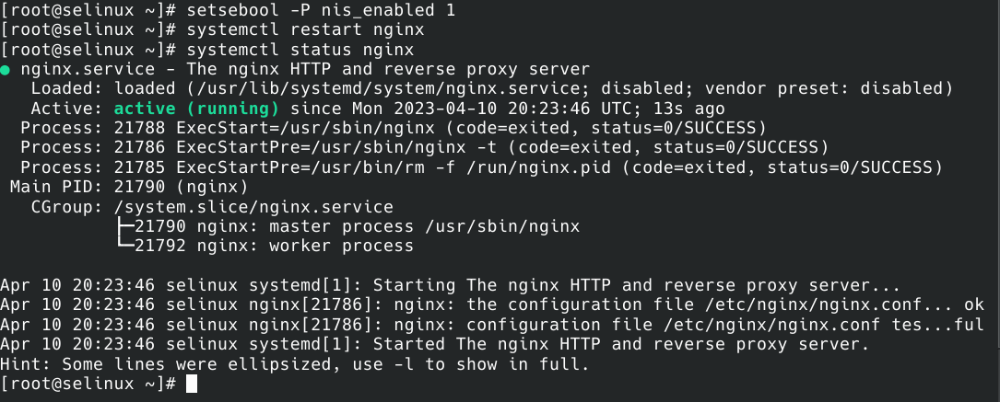  

Также можно проверить работу nginx из браузера по адресу http://127.0.0.1:4881  

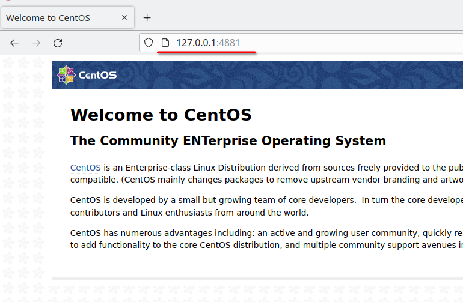  


Проверить статус параметра можно с помощью команды: *getsebool -a | grep nis_enabled*  
```bash
[root@selinux ~]# getsebool -a | grep nis_enabled
nis_enabled --> on
[root@selinux ~]#
```
Вернём запрет работы nginx на порту 4881 обратно. Для этого отключим nis_enabled: *setsebool -P nis_enabled off*  

После отключения nis_enabled служба nginx снова не запустится.  


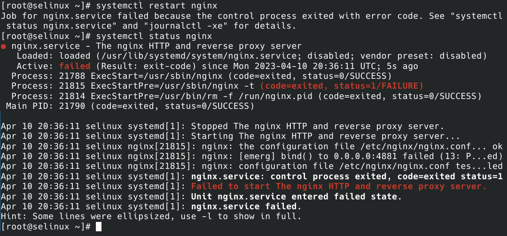  


**2.2 Разрешим в SELinux работу nginx на порту TCP 4881 c помощью добавления нестандартного порта в имеющийся тип**  

Поиск имеющегося типа, для http трафика: *semanage port -l | grep http*  
```bash
[root@selinux ~]# semanage port -l | grep http
http_cache_port_t              tcp      8080, 8118, 8123, 10001-10010
http_cache_port_t              udp      3130
http_port_t                    tcp      80, 81, 443, 488, 8008, 8009, 8443, 9000
pegasus_http_port_t            tcp      5988
pegasus_https_port_t           tcp      5989
```  
Добавим порт в тип http_port_t: *semanage port -a -t http_port_t -p tcp 4881*  

Посмотрим появился ли наш нестандартный порт:  

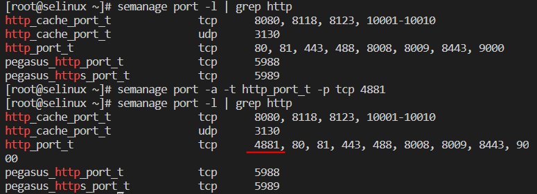  

Теперь перезапустим службу nginx и проверим её работу:  

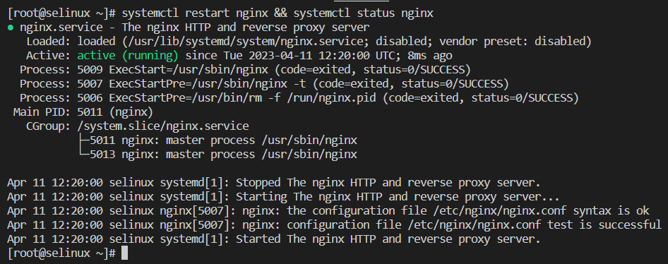  

Заново проверим работу nginx из браузера по адресу http://127.0.0.1:4881  

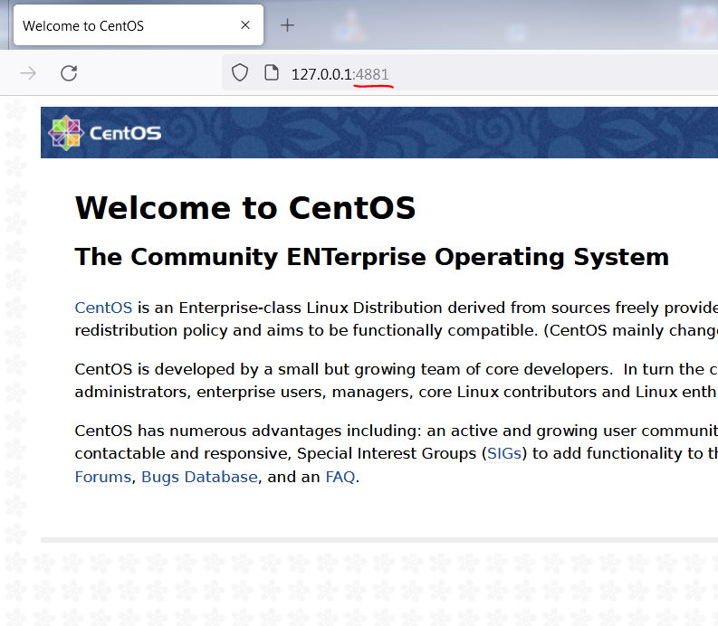  

Удалим нестандартный порт, перезапустим nginx и убедимся, что он снова "сломался"  

```bash
semanage port -d -t http_port_t -p tcp 4881
semanage port -l | grep http_port_t
systemctl restart nginx
systemctl status nginx
```  

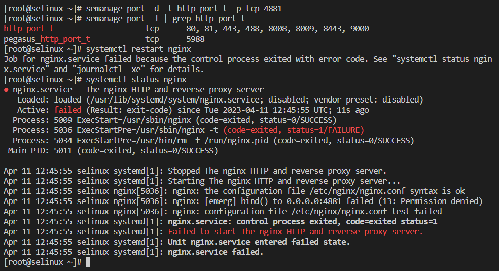  

**2.3 Разрешим в SELinux работу nginx на порту TCP 4881 c помощью формирования и установки модуля SELinux:**  

Попробуем снова запустить nginx: *systemctl start nginx*  

```bash
[root@selinux ~]# systemctl start nginx
Job for nginx.service failed because the control process exited with error code. See "systemctl status nginx.service" and "journalctl -xe" for details.
```  

Nginx не запуститься, так как SELinux продолжает его блокировать.  
Посмотрим логи SELinux, которые относятся к nginx:  

```bash
[root@selinux ~]# grep nginx /var/log/audit/audit.log
...........
type=SYSCALL msg=audit(1681217155.575:1728): arch=c000003e syscall=49 success=no exit=-13 a0=6 a1=55f31d6ba778 a2=10 a3=7ffc37535190 items=0 ppid=1 pid=5036 auid=4294967295 uid=0 gid=0 euid=0 suid=0 fsuid=0 egid=0
sgid=0 fsgid=0 tty=(none) ses=4294967295 comm="nginx" exe="/usr/sbin/nginx" subj=system_u:system_r:httpd_t:s0 key=(null)
type=SERVICE_START msg=audit(1681217155.577:1729): pid=1 uid=0 auid=4294967295 ses=4294967295 subj=system_u:system_r:init_t:s0 msg='unit=nginx comm="systemd" exe="/usr/lib/systemd/systemd" hostname=? addr=? terminal=? res=failed'
[root@selinux ~]#
```
Воспользуемся утилитой audit2allow для того, чтобы на основе логов SELinux сделать модуль, разрешающий работу nginx на нестандартном порту:  
*grep nginx /var/log/audit/audit.log | audit2allow -M nginx*  

```bash
[root@selinux ~]# grep nginx /var/log/audit/audit.log | audit2allow -M nginx
******************** IMPORTANT ***********************
To make this policy package active, execute:

semodule -i nginx.pp

[root@selinux ~]#
```  

audit2allow сформировал модуль, и сообщил нам команду, с помощью которой можно применить данный модуль: *semodule -i nginx.pp*  

Попробуем снова запустить nginx и проверим статус работы : *systemctl start nginx  && systemctl status nginx*  


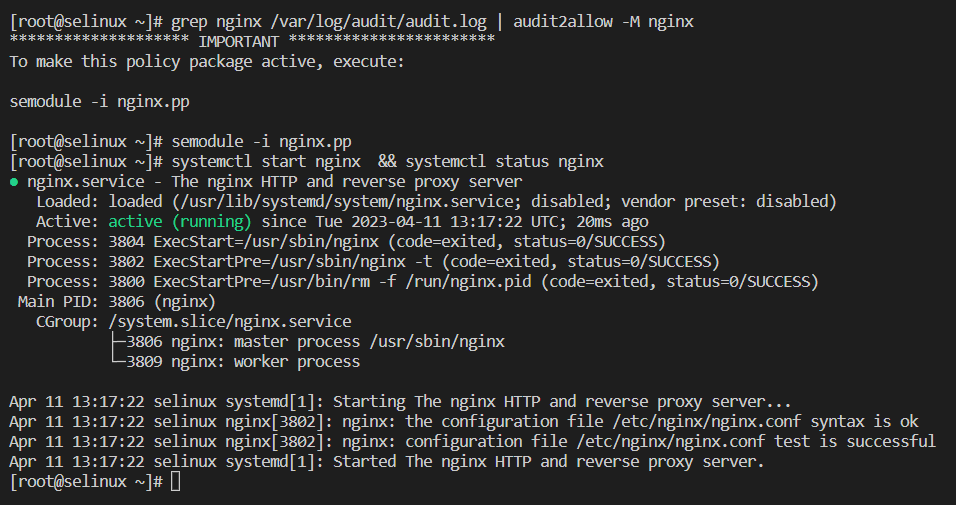  

После добавления модуля nginx запустился без ошибок. При использовании модуля изменения сохранятся после перезагрузки.  
Просмотр всех установленных модулей: *semodule -l*  
Для удаления модуля воспользуемся командой: *semodule -r nginx*  

```bash
[root@selinux ~]# semodule -r nginx
libsemanage.semanage_direct_remove_key: Removing last nginx module (no other nginx module exists at another priority).
[root@selinux ~]#
```

