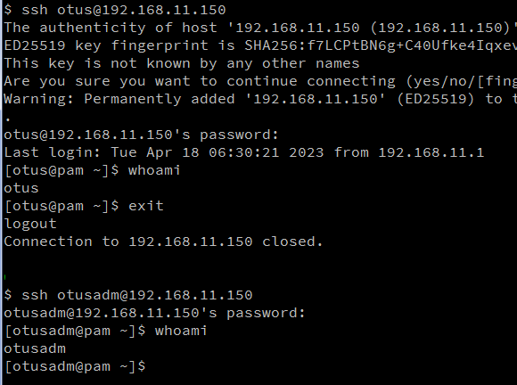
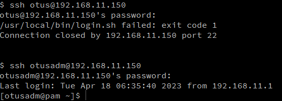

# Курс Administrator Linux. Professional

## Урок 24. Домашнее задание №15

### Пользователи и группы. Авторизация и аутентификация. PAM  
  
**Создаём виртуальную машину**  
  
Использую _[Vagrantfile](Vagrantfile)_, который в репозитории  
  
```vagrant up```  
запускаем виртуальную машину  
  
Будет создана виртуальная машина с именем **_pam_**, ip-адресом - **_192.168.11.150_**

Заходим на машину:  
```vagrant ssh pam```
  
### Настройка запрета для всех пользователей (кроме группы Admin) логина в выходные дни (Праздники не учитываются)

1. Внутри виртуалки переходим в root пользователя:  
```sudo -i```  
2. Создаём пользователя otusadm и otus. Задаём пользователям одинаковые пароли:  

```bash
 sudo useradd otusadm && sudo useradd otus    
 echo 'Otus2023!' | sudo passwd --stdin otusadm && echo 'Otus2023!' | sudo passwd --stdin otus
```

3. Создаём группу admin и добавляем в нее пользователей vagrant,root и otusadm :  

```bash
sudo groupadd -f admin  
usermod otusadm -a -G admin && usermod root -a -G admin && usermod vagrant -a -G admin
```

>_Обратите внимание, что мы просто добавили пользователя otusadm в группу admin._  
>**Это не делает пользователя otusadm администратором.**  

После создания пользователей, нужно проверить, что они могут подключаться по SSH к нашей ВМ. Для этого пытаемся подключиться с хостовой машины:
```ssh otus@192.168.11.150```  

Далее вводим наш созданный пароль Otus2023!



Если всё настроено правильно, на этом моменте мы сможет подключиться по SSH под пользователем otus и otusadm.  

4. Далее настроим правило, по которому все пользователи кроме тех, что указаны в группе _admin_ не смогут подключаться в выходные дни:  
Проверим, что пользователи root, vagrant и otusadm есть в группе admin:  

```bash
[root@pam ~]# cat /etc/group | grep admin 
printadmin:x:997:
admin:x:1003:otusadm,root,vagrant
[root@pam ~]#
```
>_Информация о группах и пользователях в них хранится в файле_ **/etc/group,** _пользователи указываются через запятую._
Выберем метод PAM-аутентификации, так как у нас используется только ограничение по времени, то было бы логично использовать метод pam_time, однако, данный метод не работает с локальными группами пользователей, и, получается, что использование данного метода добавит нам большое количество однообразных строк с разными пользователями. В текущей ситуации лучше написать небольшой скрипт контроля и использовать модуль pam_exec

5. Создадим файл-скрипт [/usr/local/bin/login.sh](login.sh), следующего содержания:  

```bash
#!/bin/bash
#Первое условие: если день недели суббота или воскресенье
if [ $(date +%a) = "Sat" ] || [ $(date +%a) = "Sun" ]; then
 #Второе условие: входит ли пользователь в группу admin
 if getent group admin | grep -qw "$PAM_USER"; then
        #Если пользователь входит в группу admin, то он может подключиться
        exit 0
      else
        #Иначе ошибка (не сможет подключиться)
        exit 1
    fi
  #Если день не выходной, то подключиться может любой пользователь
  else
    exit 0
fi
```

6. Добавим права на исполнение файла: ```chmod +x /usr/local/bin/login.sh```

7. Укажем в файле /etc/pam.d/sshd модуль pam_exec и наш скрипт:

```vi /etc/pam.d/sshd```

```bash
#%PAM-1.0
auth       required     pam_sepermit.so
auth       substack     password-auth
auth       include      postlogin
# Used with polkit to reauthorize users in remote sessions
-auth      optional     pam_reauthorize.so prepare
account    required     pam_exec.so /usr/local/bin/login.sh
account    required     pam_nologin.so
account    include      password-auth
password   include      password-auth
# pam_selinux.so close should be the first session rule
session    required     pam_selinux.so close
session    required     pam_loginuid.so
# pam_selinux.so open should only be followed by sessions to be executed in the user context
session    required     pam_selinux.so open env_params
session    required     pam_namespace.so
session    optional     pam_keyinit.so force revoke
session    include      password-auth
session    include      postlogin
# Used with polkit to reauthorize users in remote sessions
-session   optional     pam_reauthorize.so prepare

```

На этом настройка завершена, нужно только проверить, что скрипт отрабатывает корректно.  

Для проверки работы скрипта сменим дату на выходной день, ВСК 16 апреля 2023
```bash
[root@pam ~]# date 041612002023
Sun Apr 16 12:00:00 UTC 2023
[root@pam ~]# date
Sun Apr 16 12:00:05 UTC 2023
[root@pam ~]#
```



Если настройки выполнены правильно, то при логине пользователя **_otus_** у Вас должна появиться ошибка. Пользователь **_otusadm_** должен подключаться без проблем: