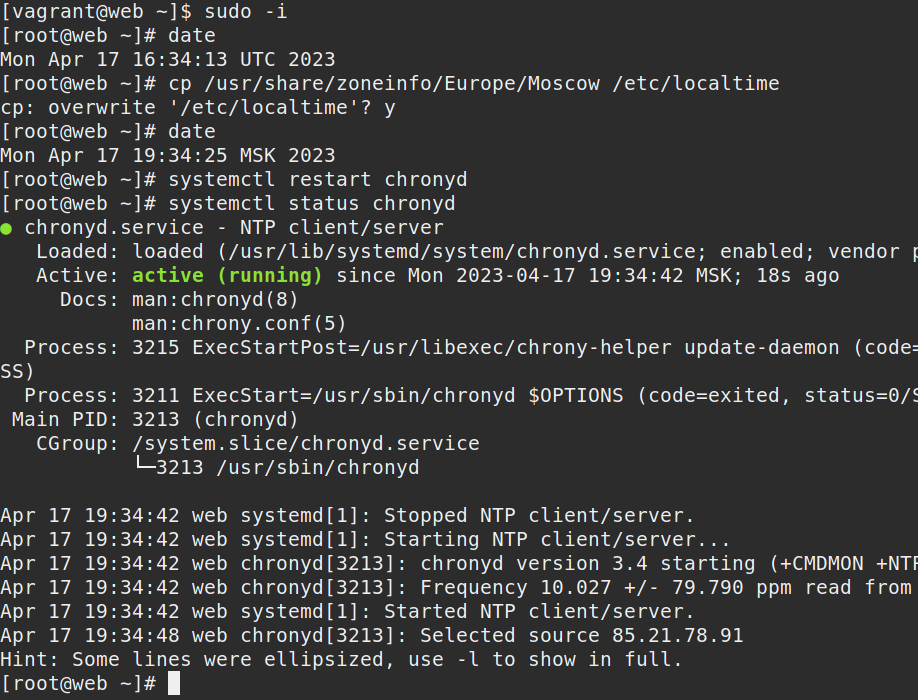
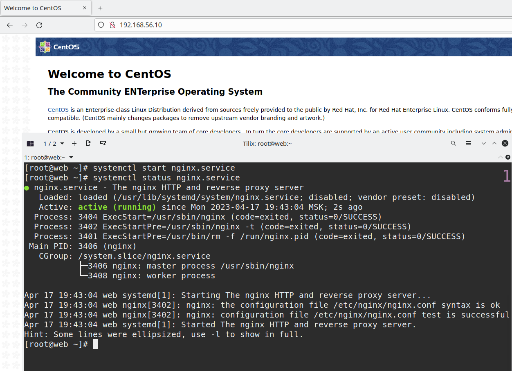
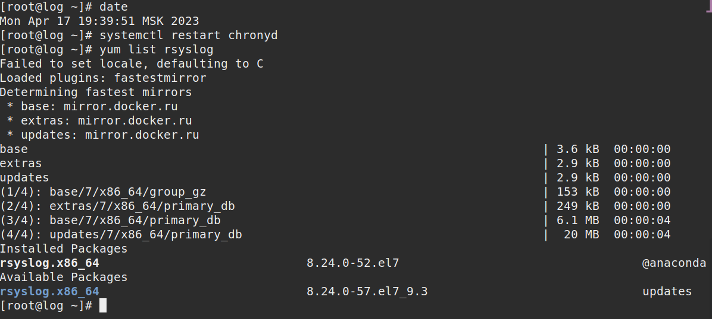
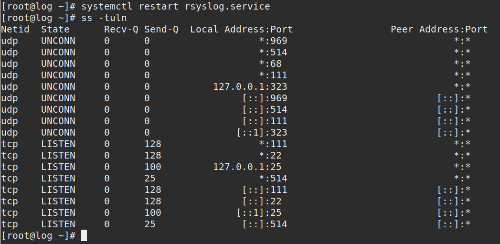

# Курс Administrator Linux. Professional

### Домашнее задание №16

### Урок26 Сбор и анализ логов

**1. Создаём виртуальные машины**  
  
Использую Vagrantfile, который в репозитории
  
```vagrant up```  
запускаем виртуальные машины  
  
Будут созданы две виртуальные машины web-сервер с именем **_web_**, ip-адресом - **_192.168.56.10_** и сборщик логов с именем **_log_**, ip-адресом - **_192.168.56.11_**.  

Заходим на web-сервер:  
```vagrant ssh web```  

Внутри виртуалки переходим в root пользователя:  
```sudo -i```  

**2. Настройка времени**  

Для правильной работы c логами, нужно, чтобы на всех хостах было настроено одинаковое время.  
Укажем часовой пояс (Московское время):  

```bash
cp /usr/share/zoneinfo/Europe/Moscow /etc/localtime
```

Перезупустим службу NTP Chrony:  

```bash
systemctl restart chronyd
```

Проверим, что служба работает корректно:

```bash
systemctl status chronyd
```

  


Далее проверим, что время и дата указаны правильно:

```bash
date
```

  


**Настроить NTP нужно на обоих серверах.**

**3. Установка NGINX на сервере WEB**  

Для установки nginx сначала нужно установить epel-release, а затем nginx:

```bash
yum install epel-release 
yum install -y nginx  
```

Запустим и проверим, что nginx работает корректно:

```bash
systemctl start nginx
systemctl status nginx
```

  

Также работу nginx можно проверить на хосте. В браузере ввведем в адерсную строку <http://192.168.56.10>

**4. Настройка центрального сервера сбора логов**

Подключимся по ssh к ВМ log: _vagrant ssh log_
Перейдем в пользователя root: _sudo -i_
rsyslog должен быть установлен по умолчанию в нашёй ОС, проверим это:

```bash
yum list rsyslog
```
  

Все настройки Rsyslog хранятся в файле /etc/rsyslog.conf  
Для того, чтобы наш сервер мог принимать логи, нам необходимо внести следующие изменения в файл:  
Открываем порт 514 (TCP и UDP):  
Находим и раскомментируем строки:  

```bash
# Provides UDP syslog reception
$ModLoad imudp
$UDPServerRun 514

# Provides TCP syslog reception
$ModLoad imtcp
$InputTCPServerRun 514
```

В конец файла /etc/rsyslog.conf добавляем правила приёма сообщений от хостов:  

```bash
#Add remote logs
$template RemoteLogs,"/var/log/rsyslog/%HOSTNAME%/%PROGRAMNAME%.log"
*.* ?RemoteLogs
& ~
```
Далее сохраняем файл и перезапускаем службу rsyslog: ```systemctl restart rsyslog```  
Если ошибок не допущено, то у нас будут видны открытые порты TCP,UDP 514:  


  


