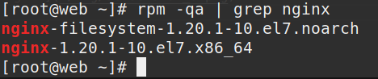
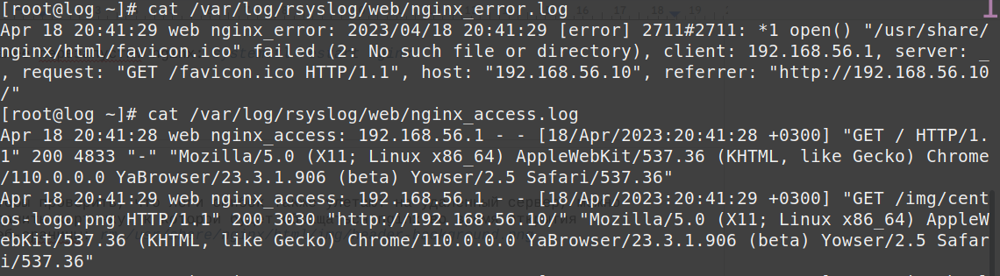

# Курс Administrator Linux. Professional

### Домашнее задание №16

### Урок26 Сбор и анализ логов

**1. Создаём виртуальные машины**  
  
Использую Vagrantfile, который в репозитории
  
```vagrant up```  
запускаем виртуальные машины  
  
Будут созданы две виртуальные машины web-сервер с именем **_web_**, ip-адресом - **_192.168.56.10_** и сборщик логов с именем **_log_**, ip-адресом - **_192.168.56.11_**.  

Заходим на web-сервер:  
```vagrant ssh web```  

Внутри виртуалки переходим в root пользователя:  
```sudo -i```  

**2. Настройка времени**  

Для правильной работы c логами, нужно, чтобы на всех хостах было настроено одинаковое время.  
Укажем часовой пояс (Московское время):  

```bash
cp /usr/share/zoneinfo/Europe/Moscow /etc/localtime
```

Перезупустим службу NTP Chrony:  

```bash
systemctl restart chronyd
```

Проверим, что служба работает корректно:

```bash
systemctl status chronyd
```

  


Далее проверим, что время и дата указаны правильно:

```bash
date
```

  


**Настроить NTP нужно на обоих серверах.**

**3. Установка NGINX на сервере WEB**  

Для установки nginx сначала нужно установить epel-release, а затем nginx:

```bash
yum install epel-release 
yum install -y nginx  
```

Запустим и проверим, что nginx работает корректно:

```bash
systemctl start nginx
systemctl status nginx
```

  

Также работу nginx можно проверить на хосте. В браузере ввведем в адерсную строку <http://192.168.56.10>

**4. Настройка центрального сервера сбора логов**

Подключимся по ssh к ВМ log: _vagrant ssh log_
Перейдем в пользователя root: _sudo -i_
rsyslog должен быть установлен по умолчанию в нашёй ОС, проверим это:

```bash
yum list rsyslog
```
  

Все настройки Rsyslog хранятся в файле /etc/rsyslog.conf  
Для того, чтобы наш сервер мог принимать логи, нам необходимо внести следующие изменения в файл:  
Открываем порт 514 (TCP и UDP):  
Находим и раскомментируем строки:  

```bash
# Provides UDP syslog reception
$ModLoad imudp
$UDPServerRun 514

# Provides TCP syslog reception
$ModLoad imtcp
$InputTCPServerRun 514
```

В конец файла /etc/rsyslog.conf добавляем правила приёма сообщений от хостов:  

```bash
#Add remote logs
$template RemoteLogs,"/var/log/rsyslog/%HOSTNAME%/%PROGRAMNAME%.log"
*.* ?RemoteLogs
& ~
```
Далее сохраняем файл и перезапускаем службу rsyslog: ```systemctl restart rsyslog```  
Если ошибок не допущено, то у нас будут видны открытые порты TCP,UDP 514:  

  

**5. Настройка отправки логов с web-сервера**  

Заходим на web сервер: _vagrant ssh web_  
Переходим в root пользователя: _sudo -i_  
Проверим версию nginx: _rpm -qa | grep nginx_  
>Версия nginx должна быть 1.7 или выше. В нашем примере используется версия nginx 1.20

  

В файле конфигурации web-сервера /etc/nginx/nginx.conf раздел с логами и приводим к следующему виду:  

```bash
error_log /var/log/nginx/error.log;
error_log syslog:server=192.168.56.11:514,tag=nginx_error;
...
access_log syslog:server=192.168.56.11:514,tag=nginx_access,severity=info combined;
...
```  
Для access_log указываем удаленный сервер и уровень логов, которые нужно отправлять.  
Для error_log добавляем удаленный сервер. Если требуется чтобы логи хранились локально и отправлялись на удаленный сервер, требуется указать 2 строки. 	
Tag нужен для того, чтобы логи записывались в разные файлы.  
По умолчанию, error-логи отправляют логи, которые имеют severity: error, crit, alert и emerg. Если трубуется хранить или пересылать логи с другим severity, то это также можно указать в настройках nginx. 
Далее проверяем, что конфигурация nginx указана правильно: _nginx -t_  
```bash
[root@web ~]# nginx -t
nginx: the configuration file /etc/nginx/nginx.conf syntax is ok
nginx: configuration file /etc/nginx/nginx.conf test is successful
[root@web ~]# 
```
Далее перезапустим nginx: _systemctl restart nginx_  

Чтобы проверить, что логи ошибок также улетают на удаленный сервер, можно удалить картинку, к которой будет обращаться nginx во время открытия веб-сраницы: _rm /usr/share/nginx/html/img/header-background.png_

Попробуем несколько раз зайти по адресу **http://192.168.50.10**
Далее заходим на log-сервер и смотрим информацию об nginx:
```
cat /var/log/rsyslog/web/nginx_access.log 
cat /var/log/rsyslog/web/nginx_error.log 
```

  
