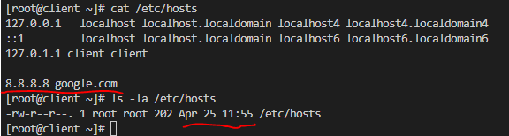
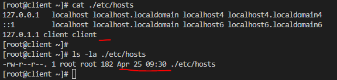

# Курс Administrator Linux. Professional

## Урок 28. Домашнее задание №17

### Резервное копирование. Настраиваем бэкапы  
  
**Создаём виртуальные машины**  
  
Использую _[Vagrantfile](Vagrantfile)_, который в репозитории  
  
```vagrant up```  
запускаем виртуальные машины  
  
Будут созданы виртуальные машины:  
с именем **_client_**, ip-адресом - **_192.168.11.150_**  
с именем **_backup_**, ip-адресом - **_192.168.11.160_**  

Отработает _[скрипт](install_script.sh)_, который установит на обе машины необходимое ПО   


Заходим на машину:  
```vagrant ssh backup```  
С помощью программы cfdisk и утилиты mkfs.ext4 создаем радел _sdb1_  
Примонтируем раздел второго жесткого диска:  
```bash
[root@backup ~]# mkdir /var/backup
[root@backup ~]# mount /dev/sdb1 /var/backup/
[root@backup ~]# lsblk
NAME   MAJ:MIN RM SIZE RO TYPE MOUNTPOINT
sda      8:0    0  40G  0 disk
└─sda1   8:1    0  40G  0 part /
sdb      8:16   0   2G  0 disk
└─sdb1   8:17   0   2G  0 part /var/backup
```
для постоянного монтирования нашего жесткого диска для бэкапов в файле _/etc/fstab_ добавим сторку:  

```/dev/sdb1 /var/backup/ ext4   defaults        0 0```


Создаем пользователя borg и даем права на папку для бэкапа этому пользователю

```bash
[root@backup ~]# useradd -m borg			
[root@backup ~]# chown borg:borg /var/backup/
```

Так же на обоих машинах нужно настроить между собой ssh соединение по ключу.
На сервер backup создаем каталог ~/.ssh/ и файл authorized_keys в каталоге /home/borg и установить прав доступа к файлам и каталогам  
```bash
[root@backup ~]# su - borg
[borg@backup ~]$ mkdir .ssh
[borg@backup ~]$ touch .ssh/authorized_keys
[borg@backup ~]$ chmod 700 .ssh
[borg@backup ~]$ chmod 600 .ssh/authorized_keys
```

На ВМ client генерируем ssh-ключ и добавляем его на сервер backup  в файл authorized_keys созданным на прошлом шаге 
```ssh-keygen```

>ВАЖНО!!! Закрытый ключ обязательно д.б. в папке пользователя от чьего имени будет проводится инициализация репозитория borg
``` ~/$USER/.ssh/id_rsa ```

Все дальнейшие действия будут проходить на машине **_client_**  

Инициализируем зашифрованый репозиторий borg на backup сервере с client сервера:
```bash
borg init --encryption=repokey borg@192.168.11.160:/var/backup/repo
```
Так же можно создать незашифрованый репозиторий, для этого применяем команду:
```bash
borg init -e none borg@192.168.11.160:/var/backup/myrepo2
```
После выполнения этих команд на сервере backup появились папки репозиториев: 

```bash
[root@backup ~]# ls -la /var/backup/
total 28
drwxr-xr-x.  5 borg borg  4096 Apr 25 11:17 .
drwxr-xr-x. 19 root root   268 Apr 25 10:09 ..
drwx------.  2 borg borg 16384 Apr 25 10:09 lost+found
drwx------.  3 borg borg  4096 Apr 25 11:17 myrepo2
drwx------.  3 borg borg  4096 Apr 25 11:16 repo
```

Запускаем для проверки создания бэкапа, создадим резервную копию каталога /etc  
```borg create --stats --list borg@192.168.11.160:/var/backup/::"etc-{now:%Y-%m-%d_%H:%M:%S}" /etc```  
Команда закончилась следующим выводом на экран:  

```bash
Archive name: etc-2023-04-25_11:48:23
Archive fingerprint: 3ecd70ab33a4455ad31e065b35cd50006e06d8b22769b42690ee6601212ee7c4
Time (start): Tue, 2023-04-25 11:48:24
Time (end):   Tue, 2023-04-25 11:48:29
Duration: 5.09 seconds
Number of files: 1700
Utilization of max. archive size: 0%
------------------------------------------------------------------------------
                       Original size      Compressed size    Deduplicated size
This archive:               28.43 MB             13.49 MB             11.84 MB
All archives:               28.43 MB             13.49 MB             11.84 MB

                       Unique chunks         Total chunks
Chunk index:                    1280                 1697
------------------------------------------------------------------------------
[root@client ~]#
```

Смотрим, что у нас получилось
```bash
[root@client ~]# borg list borg@192.168.11.160:/var/backup/repo
etc-2023-04-25_11:48:23              Tue, 2023-04-25 11:48:24 [3ecd70ab33a4455ad31e065b35cd50006e06d8b22769b42690ee6601212ee7c4]
[root@client ~]#
```

Смотрим список файлов  
```borg list borg@192.168.11.160:/var/backup/repo::etc-2023-04-25_11:48:23```

Изменяем к примеру файл /etc/hosts , а затем заменим его из резервной копии:  

  

Достаем файл из бекапа  
```borg extract borg@192.168.11.160:/var/backup/repo::etc-2023-04-25_11:48:23 etc/hosts```  
файл распоковывается в текущую папку в каталог архива, в нашем случае _etc_  

  

при необходимости меняем текущий файл на файл из резервной копии.  


### Автоматизируем создание бэкапов с помощью systemd  

Создаем сервис и таймер в каталоге /etc/systemd/system/

```bash
#vi /etc/systemd/system/borg-backup.service  

[Unit]
Description=Borg Backup

[Service]
Type=oneshot

# Парольная фраза
Environment="BORG_PASSPHRASE=Otus1234"
# Репозиторий
Environment=REPO=borg@192.168.11.160:/var/backup/repo
# Что бэкапим
Environment=BACKUP_TARGET=/etc

# Создание бэкапа
ExecStart=/bin/borg create \
    --stats                \
    ${REPO}::etc-{now:%%Y-%%m-%%d_%%H:%%M:%%S} ${BACKUP_TARGET}

# Проверка бэкапа
ExecStart=/bin/borg check ${REPO}

# Очистка старых бэкапов
ExecStart=/bin/borg prune \
    --keep-daily  90      \
    --keep-monthly 12     \
    --keep-yearly  1       \
    ${REPO}
```

```bash
# /etc/systemd/system/borg-backup.timer
[Unit]
Description=Borg Backup

[Timer]
OnUnitActiveSec=5min

[Install]
WantedBy=timers.target
```
Включаем и запускаем службу таймера  
```bash
# systemctl enable borg-backup.timer 
# systemctl start borg-backup.timer
```

Проверяем работу таймера
```bash
[root@client ~]# systemctl list-timers --all
NEXT                         LEFT          LAST                         PASSED       UNIT                         ACTIVATES
Tue 2023-04-25 13:26:28 UTC  42s left Tue 2023-04-25 13:21:28 UTC  4min 17s ago borg-backup.timer            borg-backup.service
```

Проверяем список бекапов
```bash
[root@client ~]# borg list borg@192.168.11.160:/var/backup/repo
etc-2023-04-25_13:21:29              Tue, 2023-04-25 13:21:30 [3ab380eaf402d1edd6dc66f7c8018b7fc9cee3b1df381cbc7b92f8c33ba1f7f7]
etc-2023-04-25_13:27:29              Tue, 2023-04-25 13:27:30 [e506c7a10593e69b07660448427bee73462cea2a825769fb2c84b0b3ff78e2f6]
etc-2023-04-25_13:33:29              Tue, 2023-04-25 13:33:30 [d42d4043f4cf366ed2c1bfa781b1787d98d1943b4035574bf762b2d4d14feb55]
```
