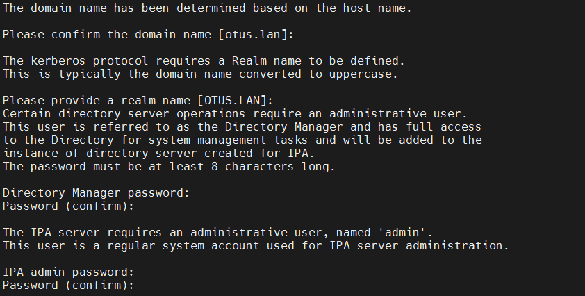
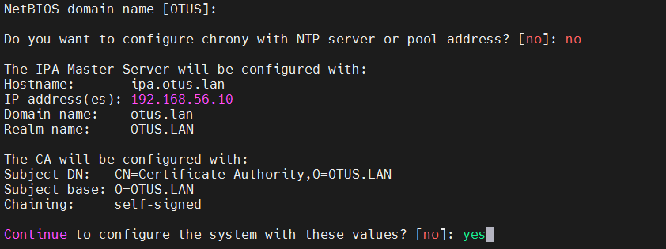
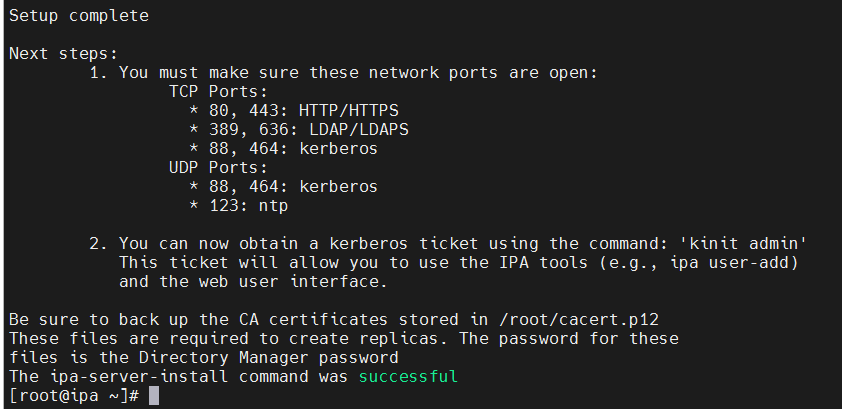
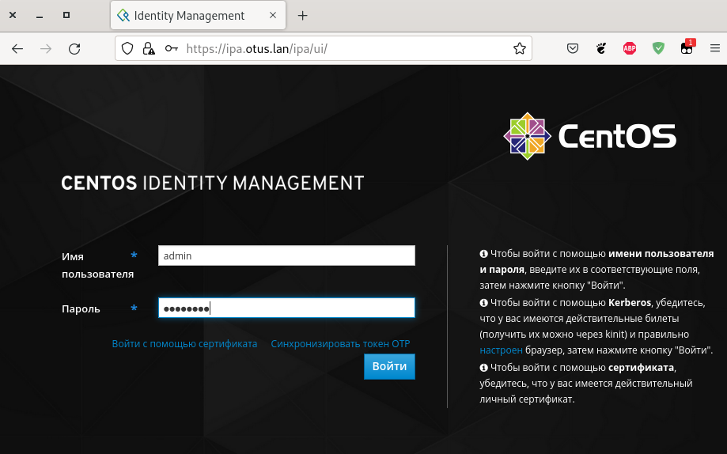
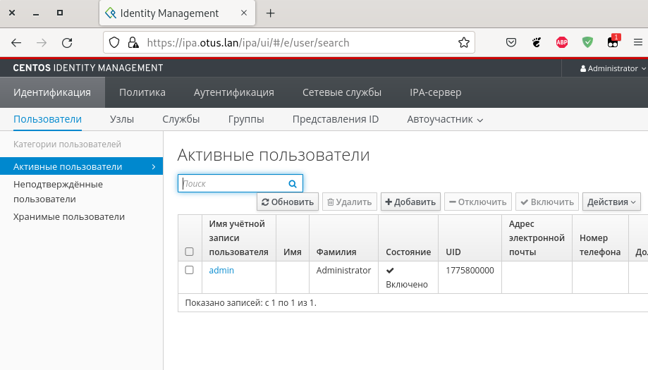
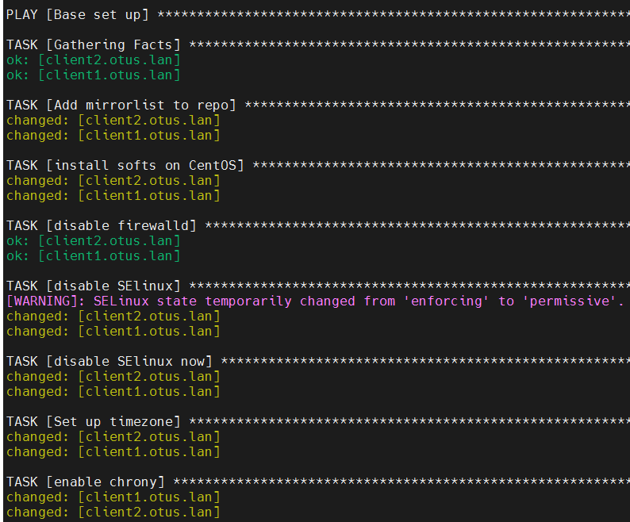

# Курс Administrator Linux. Professional

## Урок 39. Домашнее задание №24

### LDAP. Централизованная авторизация и аутентификация 
  
**Создаём виртуальные машины**  
  
Использую _[Vagrantfile](Vagrantfile)_, который в репозитории  
  
```vagrant up```  
запускаем виртуальные машины  
  
Будут созданы виртуальные машины:  
с именем **_ipa.otus.lan_**, ip-адресом - **_192.168.56.10_**  
с именем **_client1.otus.lan_**, ip-адресом - **_192.168.56.11_**  
с именем **_client2.otus.lan_**, ip-адресом - **_192.168.56.12_**  

с ОС CentOS 8 Stream, каждая ВМ будет иметь по 2ГБ ОЗУ и по одному ядру CPU.  

### 1. Установка FreeIPA сервера

Для начала нам необходимо настроить [FreeIPA-сервер](https://www.freeipa.org/page/About). Подключимся к нему по SSH с помощью команды: ```vagrant ssh ipa.otus.lan``` и перейдём в root-пользователя: ```sudo -i```  

>На момент написания ДЗ ОС Centos8 выдавала ошибку при обновлении или установки пакетов
>
>Решение:
>в консоли выполнить команду:  
>cd /etc/yum.repos.d/ | sed -i 's/mirrorlist/#mirrorlist/g' /etc/yum.repos.d/CentOS-* | sed -i 's|#baseurl=http://mirror.centos.org|baseurl=http://vault.centos.org|g' /etc/yum.repos.d/CentOS-*
  

Сделаем настройку FreeIPA-сервера:  
Установим часовой пояс: ```timedatectl set-timezone Europe/Moscow```  
Установим утилиту chrony: ```yum install -y chrony```  
Запустим chrony и добавим его в автозагрузку: ```systemctl enable chronyd --now```  
Выключим Firewall: ```systemctl stop firewalld```  
Отключим автозапуск Firewalld: ```systemctl disable firewalld```  
Остановим Selinux: ```setenforce 0```  
Для полного отключеия Selinux, поменяем в файле _/etc/selinux/config_, параметр _SELINUX_ на **disabled**  
```vi /etc/selinux/config```  
```bash
# This file controls the state of SELinux on the system.
# SELINUX= can take one of these three values:
#     enforcing - SELinux security policy is enforced.
#     permissive - SELinux prints warnings instead of enforcing.
#     disabled - No SELinux policy is loaded.
SELINUX=disabled
# SELINUXTYPE= can take one of these three values:
#     targeted - Targeted processes are protected,
#     minimum - Modification of targeted policy. Only selected processes are protected. 
#     mls - Multi Level Security protection.
SELINUXTYPE=targeted
```

Для дальнейшей настройки FreeIPA нам потребуется, чтобы DNS-сервер хранил запись о нашем LDAP-сервере. В рамках данной лабораторной работы мы не будем настраивать отдельный DNS-сервер и просто добавим запись в файл /etc/hosts
```vi /etc/hosts```
```bash
127.0.0.1   localhost localhost.localdomain 
127.0.1.1 ipa.otus.lan ipa
192.168.56.10 ipa.otus.lan ipa
```

Установим модуль DL1: ```yum install -y @idm:DL1```  
Установим FreeIPA-сервер: ```yum install -y ipa-server```  

Запустим скрипт установки: ```ipa-server-install```
>Потребуется указать параметры нашего LDAP-сервера, после ввода каждого параметра >нажимаем Enter, если нас устраивает параметр, указанный в квадратных скобках, то >можно сразу нажимать Enter:

Далее начнётся процесс установки. Процесс установки занимает примерно 10-15 минут (иногда время может быть другим). Если мастер успешно выполнит настройку FreeIPA то в конце мы получим сообщение: 
__*The ipa-server-install command was successful*__

При вводе параметров установки мы вводили 2 пароля (не буду мудрить пароль будет 12345678):  
**Directory Manager** password — это пароль администратора сервера каталогов, У этого пользователя есть полный доступ к каталогу.  
**IPA admin** password — пароль от пользователя FreeIPA admin

Скриншоты установки:  

  
 
 
 
 

После успешной установки **FreeIPA**, проверим, что сервер Kerberos может выдать нам билет: 
```bash
[root@ipa ~]# kinit admin
Password for admin@OTUS.LAN:
[root@ipa ~]# klist
Ticket cache: KCM:0
Default principal: admin@OTUS.LAN

Valid starting     Expires            Service principal
05/04/23 16:36:40  05/05/23 16:36:35  krbtgt/OTUS.LAN@OTUS.LAN
[root@ipa ~]#
```
Для удаление полученного билета воспользуемся командой: _kdestroy_  

Мы можем зайти в Web-интерфейс нашего FreeIPA-сервера, для этого на нашей хостовой машине нужно прописать следующую строку в файле Hosts:

```192.168.56.10 ipa.otus.lan```  

 
 

Откроется веб-консоль упрвления FreeIPA. Данные во FreeIPA можно вносить как через веб-консоль, так и средствами коммандной строки.  

На этом установка и настройка FreeIPA-сервера завершена.

### 2. Пишем ansible playbook для конфигурации клиента

В каталоге с нашей лабораторной работой создадим каталог Ansible: ```mkdir ansible```
В каталоге ansible создадим файл _hosts_ со следующими параметрами:

```bash
[clients]
client1.otus.lan ansible_host=192.168.56.11 ansible_user=vagrant ansible_ssh_private_key_file=./.vagrant/machines/client1.otus.lan/virtualbox/private_key
client2.otus.lan ansible_host=192.168.56.12 ansible_user=vagrant ansible_ssh_private_key_file=./.vagrant/machines/client2.otus.lan/virtualbox/private_key
```

Далее создадим файл [provision.yml](provision.yml) в котором непосредственно будет выполняться настройка клиентов.

[Jinja-шаблон](./ansible/hosts.j2) файла _/etc/hosts_ содержит следующие строки:  

```bash
127.0.0.1   localhost localhost.localdomain localhost4 localhost4.localdomain4
::1         localhost localhost.localdomain localhost6 localhost6.localdomain6
192.168.56.10 ipa.otus.lan ipa
```

При добавлении хоста к домену мы можем просто ввести команду **_ipa-client-install_** и следовать мастеру подключения к FreeIPA-серверу.

Однако команда позволяет нам сразу задать требуемые нам параметры:  
--domain — имя домена  
--server — имя FreeIPA-сервера  
--no-ntp — не настраивать дополнительно ntp (мы уже настроили chrony)  
-p — имя админа домена  
-w — пароль администратора домена (IPA password)  
--mkhomedir — создать директории пользователей при их первом логине  

Если мы сразу укажем все параметры, то можем добавить эту команду в Ansible и автоматизировать процесс добавления хостов в домен. 

Блок с таким TASK будет выглядить следующим образом:  


```bash

 #Запуск скрипта добавления хоста к серверу
  - name: add host to ipa-server
    shell: echo -e "yes\nyes" | ipa-client-install --mkhomedir --domain=OTUS.LAN --server=ipa.otus.lan --no-ntp -p admin -w 12345678
```

Выполним на хостовой машине добавление хостов к LDAP серверу через ansible командой:  
```ansible-playbook ./ansible/provision.yml```


После подключения хостов к FreeIPA-сервер нужно проверить, что мы можем получить билет от Kerberos сервера: ```kinit admin```


Давайте проверим работу LDAP, для этого на сервере FreeIPA создадим пользователя и попробуем залогиниться к клиенту:
Авторизируемся на сервере: ```kinit admin```  
Создадим пользователя otus-user  
```bash
[root@ipa ~]# ipa user-add otus-user --first=Otus --last=User --password
```

