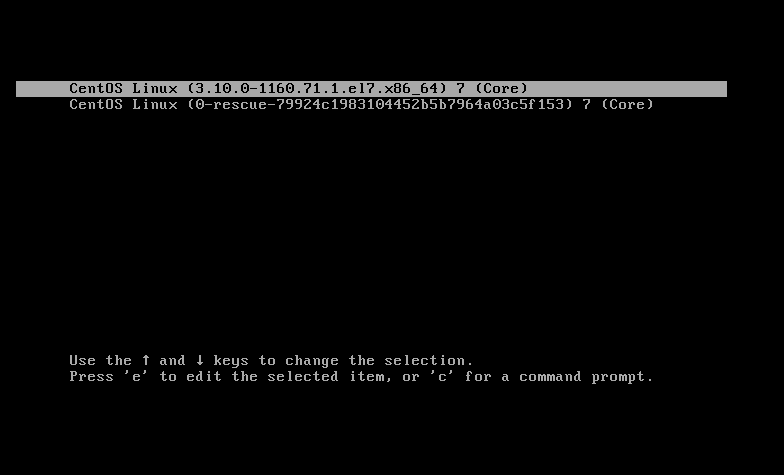
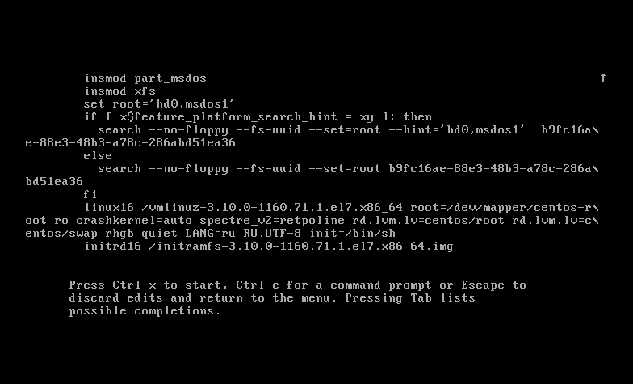
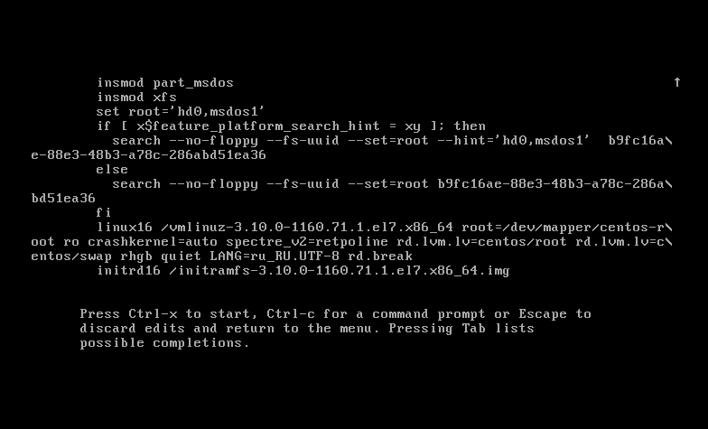
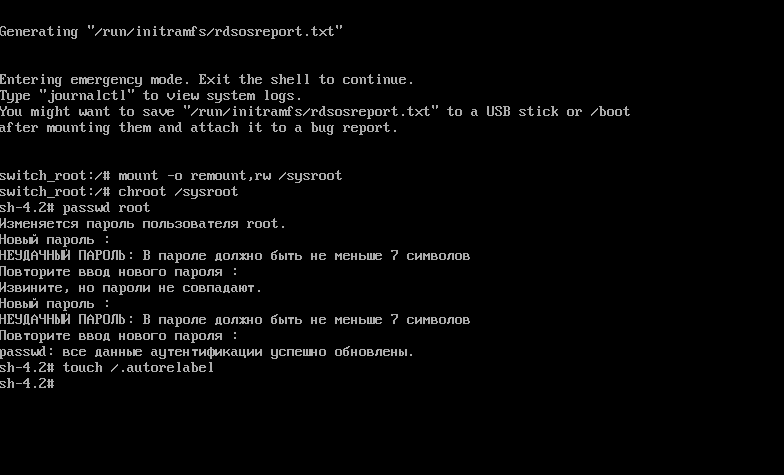
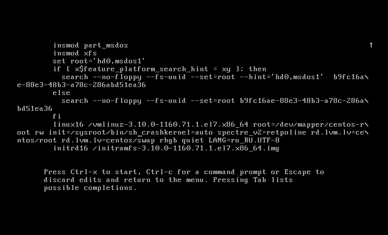
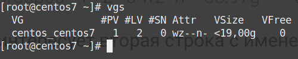
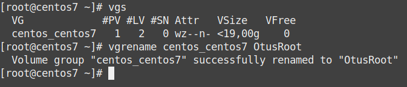
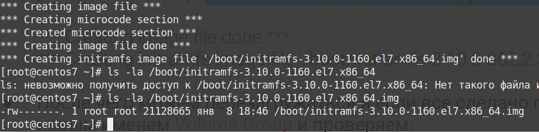
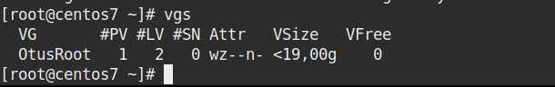

# Курс Administrator Linux. Professional

### Домашнее задание №8
### Работа с загрузчиком

в ДЗ использую виртуальную машину Centos7. Описание действий со скриншотами

**1. Попасть в систему без пароля несколькими способами**  
  
запустить виртуальную машину и при выборе ядра для загрузки нажать e - в
данном контексте edit. 



Попадаем в окно где мы можем изменить параметры загрузки:

Способ 1. **init=/bin/sh**  
В конце строки начинающейся с *linux16* добавляем *init=/bin/sh* и нажимаем **сtrl-x** для загрузки в систему  



Вы попали в систему, но Рутовая файловая система при этом монтируется в режиме Read-Only. Если вы хотите перемонтировать ее в
режим Read-Write можно воспользоваться командой:  

```bash
mount -o remount,rw /
```
проверим что рутовая фс теперь доступна на запись  
```bash
 mount | grep root
 ```


Способ 2. **rd.break**  
В конце строки начинающейся с *linux16* добавляем *rd.break* и нажимаем **сtrl-x** для загрузки в систему.  



Попадаем в emergency mode. Наша корневая файловая система смонтирована (опять же в режиме Read-Only), но мы не в ней.  
Пример как попасть в рутовую фс и поменять пароль администратора:  
```bash
mount -o remount,rw /sysroot
chroot /sysroot
passwd root
touch /.autorelabel
```


После чего можно перезагружаться и заходить в систему с новым паролем.  

Способ 3. **rw init=/sysroot/bin/sh**

В строке начинающейся с *linux16* заменяем *ro* на *rw init=/sysroot/bin/sh* и нажимаем сtrl-x
для загрузки в систему  



В целом то же самое что и в прошлом примере, но файловая система сразу
смонтирована в режим Read-Write  


**2. Переименование VG**  

посмотрим текущее состояние системы:  

```bash
vgs
```


Нас интересует вторая строка с именем Volume Group  
Приступим к переименованию:  
```bash
vgrename centos OtusRoot
```



правим [/etc/fstab](fstab), [/etc/default/grub](grub), [/boot/grub2/grub.cfg](grub.gfg). Везде заменяем старое
название на новое. По ссылкам можно увидеть примеры получившихся файлов.

Пересоздаем initrd image, чтобы он знал новое название Volume Group
```bash
mkinitrd -f -v /boot/initramfs-$(uname -r).img $(uname -r)
```




После чего можем перезагружаться и если все сделано правильно успешно грузимся с новым именем Volume Group и проверяем:  




**3. Добавить модуль в initrd**  

Скрипты модулей хранятся в каталоге /usr/lib/dracut/modules.d/. Для того чтобы добавить свой модуль создаем там папку с именем 01test:  
```bash
mkdir /usr/lib/dracut/modules.d/01test
```
В нее поместим два скрипта:  
1. [module-setup.sh](module-setup.sh) - который устанавливает модуль и вызывает скрипт test.sh  
2. [test.sh](test.sh) - собственно сам вызываемый скрипт, в нём у нас рисуется пингвинчик  

Пересобираем образ initrd  
```bash
mkinitrd -f -v /boot/initramfs-$(uname -r).img $(uname -r)
```
или  
```bash
dracut -f -v
```
Можно проверить/посмотреть какие модули загружены в образ:  

```bash
lsinitrd -m /boot/initramfs-$(uname -r).img | grep test
test
```

 
После чего можно пойти двумя путями для проверки:  
Перезагрузиться и руками выключить опции **rghb** и **quiet** и увидеть вывод  
Либо отредактировать grub.cfg убрав эти опции  

Проверю первым способом  

В итоге при загрузке будет пауза на 10 секунд и вы увидите пингвина в выводе
терминала


