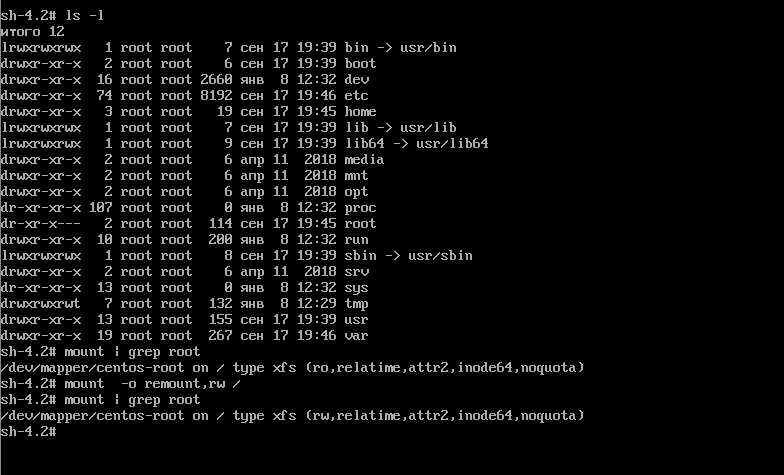

# Курс Administrator Linux. Professional

### Домашнее задание №8
### Работа с загрузчиком

в ДЗ использую виртуальную машину Centos7. Описание действий со скриншотами

**1. Попасть в систему без пароля несколькими способами**  
  
запустить виртуальную машину и при выборе ядра для загрузки нажать e - в
данном контексте edit. 


Попадаем в окно где мы можем изменить параметры загрузки:

Способ 1. **init=/bin/sh**  
В конце строки начинающейся с *linux16* добавляем *init=/bin/sh* и нажимаем **сtrl-x** для загрузки в систему  


Вы попали в систему, но Рутовая файловая система при этом монтируется в режиме Read-Only. Если вы хотите перемонтировать ее в
режим Read-Write можно воспользоваться командой:  

```bash
mount -o remount,rw /
```
проверим что рутовая фс теперь доступна на запись  
```bash
 mount | grep root
 ```



Способ 2. **rd.break**  
В конце строки начинающейся с *linux16* добавляем *rd.break* и нажимаем **сtrl-x** для загрузки в систему.  


Попадаем в emergency mode. Наша корневая файловая система смонтирована (опять же в режиме Read-Only), но мы не в ней.  
Пример как попасть в рутовую фс и поменять пароль администратора:  
```bash
mount -o remount,rw /sysroot
chroot /sysroot
passwd root
touch /.autorelabel
```


После чего можно перезагружаться и заходить в систему с новым паролем.  

Способ 3. **rw init=/sysroot/bin/sh**

В строке начинающейся с *linux16* заменяем *ro* на *rw init=/sysroot/bin/sh* и нажимаем сtrl-x
для загрузки в систему  


В целом то же самое что и в прошлом примере, но файловая система сразу
смонтирована в режим Read-Write  


**2. Переименование VG**  

Установка утилит:  
```bash
yum install nfs-utils
```  

- включаем firewall и проверяем, что он работает  

```bash
systemctl enable firewalld.service --now
systemctl status firewalld.service
```
- разрешаем в firewall доступ к сервисам NFS  
```bash
firewall-cmd --add-service="nfs3" \
            --add-service="rpc-bind" \
             --add-service="mountd" \
             --permanent
firewall-cmd --reload
```
- включаем сервер NFS и проверяем статус  
```bash
systemctl enable nfs --now
systemctl status nfs
```
- проверяем наличие слушаемых портов 2049/udp, 2049/tcp, 20048/udp, 20048/tcp, 111/udp, 111/tcp  
```bash
ss -tnplu
```
- создаём и настраиваем директорию, которая будет экспортирована в будущем  
```bash
mkdir -p /srv/share/upload
chown -R nfsnobody:nfsnobody /srv/share
chmod 0777 /srv/share/upload
```
- создаём в файле __/etc/exports__ структуру, которая позволит экспортировать ранее созданную директорию
```bash
cat << EOF > /etc/exports
/srv/share 192.168.56.11/32(rw,sync,root_squash)
EOF
```
- экспортируем ранее созданную директорию
```bash
exportfs -r
```
- проверяем экспортированную директорию следующей командой
```bash
exportfs -s
```

все вышеописаные команды записываю в скрипт **_nfss_script.sh_**

**3. Настройка клиента**  

переходим в режи root:  
```bash
su
```

Стартую script для записи действий в консоли:  
```script lesson6_client.log```  

Так же как и на сервере сделаем установку утилит:  
```bash
yum install nfs-utils -y
```  

- включаем firewall и проверяем, что он работает  

```bash
systemctl enable firewalld.service --now
systemctl status firewalld.service
```

- добавляем в _/etc/fstab_ строку_
```
echo "192.168.56.10:/srv/share/ /mnt nfs vers=3,proto=udp,noauto,x-systemd.automount 0 0" >> /etc/fstab
```
и выполняем
```bash
systemctl daemon-reload
systemctl restart remote-fs.target
```
- заходим в директорию `/mnt/` и проверяем успешность монтирования
```bash
mount | grep mnt
```

все вышеописаные команды включаю в скрипт **_nfsc_script.sh_**


**4. Проверка работоспособности**

- заходим на сервер
- заходим в каталог `/srv/share/upload`
- создаём тестовый файл `touch check_file`

- заходим на клиент
- заходим в каталог `/mnt/upload`
- проверяем наличие ранее созданного файла
- создаём тестовый файл `touch client_file`
- проверяем, что файл успешно создан


**5. Удаление виртуальных машин и автоматизация стенда NFS**

Удаляю виртуалки

```
vagrant destroy nfss
vagrant destroy nfsc
```

Добавляем в Vagrantfile_ver0 ссылки на скрипты

у сервера  
```
nfss.vm.provision "shell", path: "nfss_script.sh"
```
  
у клиента  
```
nfss.vm.provision "shell", path: "nfsc_script.sh"
```

переименовываю файл Vagrantfile_ver0 в Vagrantfile для старта автоматизированного стенда


